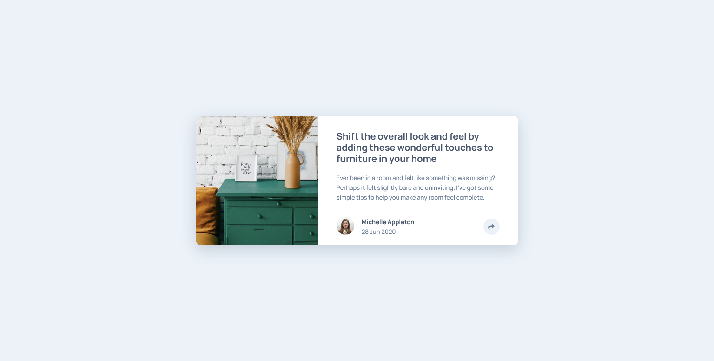

# Article Preview Card


## Links
- [Challenge Link](https://www.frontendmentor.io/challenges/article-preview-component-dYBN_pYFT)
- [Site Preview](https://robinjmm-article-preview.netlify.app/)

## About
This is my solution for the challenge of building an article preview component from [Frontendmentor.io](https://www.frontendmentor.io)

This is the second challenge where I'm using JavaScript, and thankfully nothing too complicated is involved yet. 

The layout and style of the card is rather simple to re-create. However, I struggled a lot when implementing the tool-tip and its different designs on small and large screen sizes. I managed to complete the challenge and even add some animations, but its not perfect.

Hopefully, I can come back and improve my solution in the future.

**Any feedback on how to improve my solution would be greatly appreciated.** 😊

## User Stories
The user should be able to:
- View the optimal layout for the component depending on their device's screen size
- See the social media share links when they click the share icon

## Built With
- Semantic HTML5
- CSS3
- Flexbox
- Sass
- JavaScript

## Usage
You can download the project files by clicking on the green **Code** button, then select **Download Zip**.

Once you finish extracting, move into the project folder, open the terminal, and type the following code:

```
npm install
```

This will install all the required dependencies.

To compile Sass into CSS and watch for any future changes, type the following code in your terminal:


```
npm run sass
```

To compile Sass into a minified version of CSS, run:

```
npm run prod
```

## Acknowledgement
I'm very grateful to the people at [Frontendmentor.io](https://frontendmentor.io) for providing designs and challenges that help me improve my skills as a web developer.
